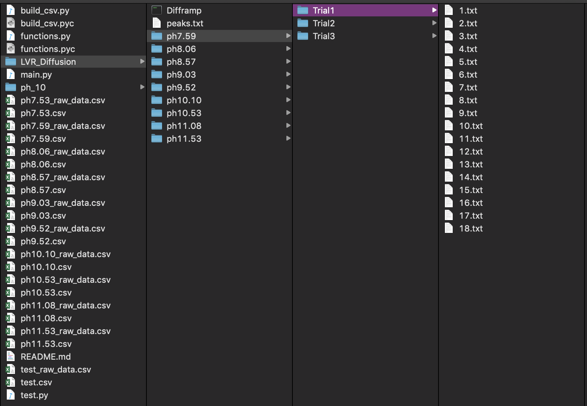

Riley Busche 2019

# NMR Data Analysis Program

The repository (and a more formatted view of this README) for this code can be found [here](https://github.com/rileybusche/nmr_data_analysis/).

`main.py`, `build_csv.py` and `functions.py` must be in the same folder for the program to function.

# Prerequisites
This program was written for Python 3.6 - though it should be forward compatible with all new versions of Python. However, it *may* not be backwards compatible with older verions of Python. 

To ensure this program works correctly, have Python 3.6 or newer installed.

# Program Arguments
The program currently has 2 user arguments, one is required (--path) in order for the program to run.

    --path 
        This is the path to the folder containing the file structure to be analyzed. The required file structure is detailed below.
        To prevent possible errors due to naming of folders, include the path in side quotation marks.
        
        Example path:
            --path "/Users/rileybusche/Research/LVR_Diffusion"
    
    --freq
        This command is used to specify the frequencies to be analyzed. Separate each new frequency with a space.
        These values are found by peaking the peaks of interest in Topspin 3.2. 

        This is only used if all the frequencies are extremely close together. Omiting this result in the program prompting the user for the peak frequencies for each pH.

        If no frequeinces are specified on the command line, you will be prompted for new frequencies for each pH.

        Example freq:
            --freq -0.1202 3.1225 5.6074

# Full Command Example:
Navigate to the folder containing `main.py`, `build_csv.py` and `functions.py` in terminal (OSx/Unix) or PowerShell/CommandPrompt (Windows) and type:
    `python main.py --path "/Users/rileybusche/Research/LVR_Diffusion" --freq -0.1202 3.1225 (--freq is optional)`

# FILE STRUCTURE

